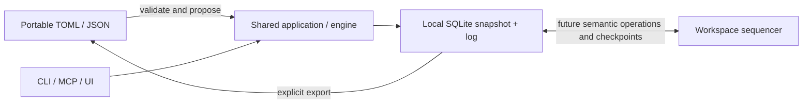

# Workspaces, portable plans and collaboration

Design direction for subsequent milestones. The capability table below separates implemented
behavior from planned contracts; keep it accurate whenever a capability lands.

## Decisions

1. A workspace is one execution graph and consistency boundary. It can contain nested projects,
   many repositories and work with no repository. A directory is an entry point, not its identity.
2. SQLite is durable operational storage. In standalone use it is authoritative; in collaborative
   use it holds a local replica and durable pending operations. It is not a disposable cache.
3. TOML is the intended human-oriented plan authoring/exchange format; JSON remains the machine
   encoding of the same versioned interchange model. Neither becomes a second writable live store.
4. Synchronization exchanges validated semantic operations and checkpoints. It never merges live
   SQLite files, Git branches or raw exported documents into running state.

## Domain and location boundaries

| Concept | Responsibility | Relationship to Git |
| --- | --- | --- |
| Workspace | Stable namespace, graph, revision stream and atomic validation boundary | Zero or many repositories |
| Project | Objective and optional parent project inside the workspace | No required repository |
| WorkItem | Task, container or milestone with scope, acceptance, dependencies and ownership | Task may use zero, one or several repositories |
| Resource binding (planned) | Stable reference to a repository, document collection or other work context | Repository URL is an attribute, not identity |
| Local binding (planned) | Device-specific checkout/worktree or folder for a resource | Ignored local configuration; never shared absolute paths |
| Artifact | Evidence linked to work, with provenance | Commit/PR or non-code evidence such as a quote, CAD file or photograph |

`WorkspaceId`, `ProjectId` and `WorkItemId` survive directory moves and repository renames. A project
hierarchy describes objectives, not checkout nesting. Current work-package containment stays within
one project; dependencies may connect tasks/milestones in different projects of the same workspace.
All such edges are validated together for reference integrity and cycles.

For example, a product workspace could contain an embedded project using a firmware repository,
an application project using a separate app repository, and a purchasing project with no Git at
all. Firmware validation, application integration and delivery inspection can feed a shared release
milestone. Procurement can use human owners and quotation/delivery evidence without invented commits.
This is a design scenario, not another bundled demo.

A task's resource references are execution context, not acceptance evidence. A task may edit two
repositories and submit two commit artifacts; inspection work may submit a report and photographs.
Repository identity plus immutable commit ID identifies Git evidence. A file artifact should carry
a durable locator and, when available, content digest/version; a mutable local path alone is weak
evidence. Relocating a checkout must not change work IDs or invalidate existing evidence.

Do not put repository paths into the scheduling core, require Git to claim/verify a task, or derive
project ownership from the current directory. Future typed resource bindings should be additive;
artifact metadata is not a substitute for a validated repository registry.

## One workspace, multiple entry points

Use one operational store per workspace. Repository A and repository B must not each receive an
independent writable copy of the same graph merely because they are separate checkouts.

```text
product-planning/              # may have no Git repository
  .dpm/project.toml            # opens the product workspace
  .dpm/state.sqlite            # local graph + operations, ignored
  plans/product.toml          # future explicit text export, optional in Git
firmware/                     # separate Git repository / worktree
  .dpm/project.toml            # future workspace/resource reference
  .dpm/local.toml              # future local binding, ignored
mobile-app/                   # separate Git repository / worktree
  .dpm/project.toml            # refers to the same workspace
```

The paths and future locator roles above are illustrative. Current locator version 1 accepts only
`version` and exactly one of `database`/`preview`; it rejects unimplemented fields.

The planned shared locator identifies a workspace and an optional default project/resource context.
Device-specific resolution belongs in an ignored local binding or an application data directory,
allowing different users, OSes and worktrees to locate the same workspace differently. A remote
endpoint is an explicit connection choice; credentials belong outside tracked configuration.
Each device keeps its own SQLite database. A portable project file never assumes another person's
filesystem layout or silently enrolls a device in collaboration.

Keep current discovery semantics: nearest explicit locator wins, invalid local configuration is an
error, and implicit upward search stops at a Git boundary. Explicit workspace references will bridge
repositories; removing that boundary would accidentally select unrelated parent workspaces. A
repository serving several workspaces must require explicit selection when no unique default exists.
Clone/worktree creation and working-directory changes must not silently fork or switch live state.

Today, `--project DIR` can select a central planning directory from any checkout. Explicit
`--database PATH` can make multiple local adapters open the same database. These are usable manual
selection mechanisms, not portable repository bindings or multi-device sync. See
[current project behavior](projects.md#multiple-repositories-and-non-code-work) for the Git-artifact
selection caveat.

## Agent and human contract

CLI, MCP and future UI/API adapters continue to call the same application queries/commands.
Execution context should eventually resolve resource IDs to checkout/document references, indicate
unavailable or ambiguous local bindings, and identify the workspace and observed revision. This is
additional context alongside the existing steps, scope, acceptance, capabilities and decision gates.

`next` ranks work in the selected workspace. Repository/context filters must be explicit and visible
in its explanation; being in one checkout must not silently hide a more important non-code task.
A missing checkout does not invalidate a project or prevent read-only planning. An action needing
that resource must report the missing binding before attaching evidence or performing work.
Multi-repository artifact capture must name the resource/checkout explicitly; ambiguity is an error.

Non-code tasks retain the same claim/block/submit/independent-verify lifecycle. Access to a file or
an exported plan grants neither actor identity nor authority to bypass its gates. A principal's
authenticated identity will be bound at the service boundary; local `actor:NAME` strings currently
provide attribution only. Device keys identify devices, while credentials attach to principals;
neither a repository account nor an Apple identity defines the core actor model.

Start collaboration permissions at the workspace boundary. Access to the plan does not automatically
grant access to its repositories or external evidence; report inaccessible resources explicitly.
Shared locators/artifact URLs must not contain embedded credentials. An intentionally redacted export
must identify itself as incomplete and cannot masquerade as a full restore snapshot. Finer project
permissions require explicit visibility/dependency semantics before serving partial graphs to agents.

## Three different file roles

| File or protocol | Role | What belongs there |
| --- | --- | --- |
| `.dpm/project.toml` | Small, versioned locator/configuration | How to open/select a workspace; no task graph |
| `plans/*.toml` (planned), current JSON export | Portable plan document | Authoritative graph inputs/state, stable IDs and export provenance |
| `.dpm/state.sqlite` or application-managed equivalent | Durable operational store | Current validated snapshot, operation history; future replica cursor and outbox |
| Semantic sync protocol (planned) | Replication and conflict resolution | Versioned command proposals, accepted operations and validated checkpoints |

The three file roles stay separate even though two use TOML. Use an explicit path outside the
ignored runtime directory for a tracked plan export. No startup file watcher imports text edits
over live state, and normal task commands do not rewrite a tracked plan file on every operation.

### Interchange contract

The future portable envelope will contain a format/schema version, workspace identity, export kind
and source provenance. Snapshot exports preserve task lifecycle, ownership, progress, contracts,
dependencies, gates and evidence references. They exclude derived schedule/ranking/layout values,
credentials, local bindings and pending synchronization metadata. Referenced evidence bytes are
separate assets; exporting their references does not embed or guarantee access to the files.

TOML and JSON must encode the same interchange DTO, independent of SQL schema and Rust struct
layout. Preserve stable IDs and references; sort entities/references deterministically for review.
Use named fields and arrays of entities instead of requiring users to edit UUID-keyed tables. Define
enum spellings, omitted optional values, timestamp precision and numeric bounds explicitly. TOML's
required integer range is signed 64-bit; encode revision/sequence tokens as strings rather than
losing the current `u64` range. Reject non-finite schedule inputs in either encoding.

A semantic round trip preserves all supported graph values, not comments, whitespace or TOML table
ordering. Instructions/acceptance remain structured graph data; linked Markdown is supporting
documentation and cannot silently override it. Future/unknown required fields must fail with a
version/feature error rather than be discarded. Keep database, API, domain and export-format versions
distinct, with explicit compatibility/migration rules. TOML interchange needs its own tests; adding
a TOML locator parser does not implement it.

Plan snapshots are not backups of operation history. An audit/restore bundle additionally needs a
consistent checkpoint, operation suffix, lineage/schema information and evidence inventory. Pending
local operations must be included in a local recovery backup. SQLite's backup API provides a
consistent database snapshot; copying only an active main file is not an equivalent backup.

### Import and editing boundaries

Read-only preview validates a document and serves queries from memory, as the current self-host
preview does. A writable workspace only changes through commands:

1. Decode/migrate a supported document, resolve references and validate the entire candidate graph.
2. Show a semantic diff against an explicitly selected workspace/revision.
3. Apply an authorized change proposal atomically through the engine with actor, reason and base
   revision. Recheck current state; stale input must conflict rather than overwrite intervening work.

Lifecycle/evidence changes in a document do not grant permission to fabricate completion or replace
independent verification. Existing-workspace imports must respect the same transition and identity
rules as ordinary commands. Missing items are explicit proposed deletions with reference checks,
not silent removal. Invalid imports leave both graph and operation history unchanged.

Distinguish initialization, fork, restore and join. A new independent project/fork gets a new
workspace identity and consistent ID remapping; source IDs remain provenance. Restoring an owned
workspace preserves its identity and requires explicit recovery/lineage handling. Joining an
existing collaborative workspace requires authenticated enrollment and its checkpoint/protocol,
not an arbitrary file with matching UUIDs. Turning a snapshot into an unstarted template is an
explicit transformation of lifecycle/ownership/evidence, not a hidden import default.

Current JSON import only initializes an empty database from a validated snapshot and preserves its
IDs/revision; it does not import operation history, implement these fork/restore/join modes, or
apply edits to an existing workspace. Identical IDs in two copied databases do not prove shared
lineage. A future sync implementation must establish lineage explicitly before connecting them.

## Operational authority and synchronization

In standalone mode, the local committed snapshot and operation log are the operational record.
A previous TOML/JSON export can be stale and cannot reconstruct later actions. SQLite is the live
store, not a cache rebuilt from that file on startup.

For the first collaborative mode, choose one logical sequencer per workspace: a server accepts
commands in an authoritative order while each client stores an accepted replica plus a durable
outbox. This allows a self-hosted service; no mandatory SaaS is implied. Server persistence may use
SQLite or another transactional store without exposing that choice in the domain/wire contract.



The future exchange envelope needs workspace/lineage identity, stable operation ID, principal/device
identity, command schema version, observed base revision and the command/reason. The sequencer binds
the principal to authentication, checks authorization and domain invariants, then atomically appends
the accepted operation and resulting state. Client timestamps are provenance, not an ordering rule.
Retries deduplicate by operation ID; reusing an ID with different content is an error. Pull resumes
from an opaque checkpoint/cursor; gaps require a validated checkpoint plus subsequent operations.

Two clients can be at numeric revision 12 with different histories. Do not use the existing wrapping
counter alone as global identity or compare it as a wall clock. Introduce lineage/epoch and opaque
revision tokens when implementing sync, with explicit migration from current local revisions.

Offline proposals stay durable and visibly pending; they are not accepted global operations.
Optimistic local views must distinguish pending and accepted state. A disconnected claim is
tentative and cannot promise exclusive ownership; an agent needing exclusivity must wait for
acknowledgement. On reconnect, stale proposals return structured conflicts. Two claims on one task
cannot both win; incompatible edits must be re-proposed with a fresh base after review. Rejected
proposals remain inspectable rather than being silently dropped or rewritten as accepted history.
The first sync version should reject stale commands conservatively rather than auto-merge them.

The same validator guards imports, local commands, sync pushes and checkpoint installation. Text
CRDTs may later serve comments/presence; they cannot directly change task status, dependencies,
ownership, gates or acceptance. Cross-workspace dependency federation is deferred; a related set
of projects should use one workspace for atomic graph validation. Independently governed workspaces
will need explicit external milestone contracts, not an implicit cross-database transaction.

This boundary is not a claim of large-portfolio performance. The current store rewrites a whole JSON
snapshot, and validation/scheduling inspect the graph. Measure realistic graph sizes before adding
normalized indexes, incremental projections or partitioning; preserve revision-consistent queries and
whole-graph invariants when optimizing. Separate repositories alone are no reason to shard state.

Do not synchronize a live SQLite database with Git, cloud-folder file copying or a network share.
WAL is host-local and its sidecar can contain committed data absent from the main file. Synchronize
semantic operations; use consistent backups for transfer/recovery. Ignoring a file in Git is not a
backup policy, and unsent local operations cannot be thrown away when refreshing a replica.

## Current capability and implementation sequence

| Area | Implemented now | Required before claiming the next capability |
| --- | --- | --- |
| Cross-project/non-code graph | Stable IDs, nested projects, generic work/evidence, cross-project dependency edges | Dedicated mixed/cross-project acceptance cases |
| Opening from several checkouts | Explicit project/database selection; closest locator and Git boundary | Portable resource IDs and local bindings, unambiguous evidence selection |
| Plan files | TOML locator; validated JSON preview/import/export | Versioned interchange DTO, TOML encoding and semantic round-trip tests |
| Runtime state | SQLite snapshot + atomic append-only operations | Versioned migrations, history/recovery contracts before schema expansion |
| Collaboration | Local optimistic revision checks only | Checkpoint/lineage, durable outbox, authenticated sequencer and conflicts |

Implement format/versioning and location contracts before remote sync. Keep current self-host JSON
preview and all task gates intact until a lossless TOML implementation is tested. DPM's own roadmap
should eventually use the same import, operation and synchronization paths as an external user's
workspace; shipping a read-only example must not create a special product-only authority model.

Acceptance for future increments includes two differently located checkouts sharing one workspace,
one non-Git human task, multi-repository artifacts, a repository rename with stable resource IDs,
TOML/JSON semantic equality, stale/invalid import rejection, no text/store overwrite, two offline
claims with one accepted winner, duplicate push handling, and recovery without losing pending work.
No future capability in this document is implemented merely by documenting its contract.

## Format and storage references

- [TOML specification](https://toml.io/en/v1.0.0): format types and integer range.
- [SQLite WAL](https://www.sqlite.org/wal.html): sidecar persistence and host-local concurrency.
- [SQLite backup API](https://www.sqlite.org/backup.html): consistent live-database snapshots.
- [Git ignore rules](https://git-scm.com/docs/gitignore): matching and already tracked files.
